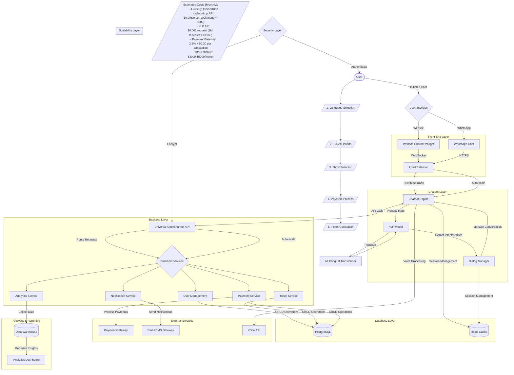

```mermaid
flowchart TD
    User([User]) --> |Initiates Chat| UI{User Interface}
    UI --> |Website| WebWidget[Website Chatbot Widget]
    UI --> |WhatsApp| WAChat[WhatsApp Chat]
    
    subgraph FrontEnd [Front-End Layer]
        WebWidget --> |WebSocket| LB[Load Balancer]
        WAChat --> |HTTPS| LB
    end
    
    LB --> |Distribute Traffic| CE[Chatbot Engine]
    
    subgraph ChatbotLayer [Chatbot Layer]
        CE --> |Process Input| NLP[NLP Model]
        NLP --> |Extract Intent/Entities| DM[Dialog Manager]
        DM --> |Manage Conversation| CE
    end
    
    CE <--> |API Calls| API[Universal Omnichannel API]
    
    subgraph BackendLayer [Backend Layer]
        API --> |Route Requests| BS{Backend Services}
        BS --> UM[User Management]
        BS --> TS[Ticket Service]
        BS --> PS[Payment Service]
        BS --> NS[Notification Service]
        BS --> AS[Analytics Service]
    end
    
    subgraph DatabaseLayer [Database Layer]
        UM & TS & PS --> |CRUD Operations| PSQL[(PostgreSQL)]
        CE & DM --> |Session Management| Redis[(Redis Cache)]
    end
    
    subgraph ExternalServices [External Services]
        PS --> |Process Payments| PG[Payment Gateway]
        NS --> |Send Notifications| MSG[Email/SMS Gateway]
        CE --> |Voice Processing| VP[Voice API]
    end
    
    subgraph Analytics [Analytics & Reporting]
        AS --> |Collect Data| DW[(Data Warehouse)]
        DW --> |Generate Insights| Dashboard[Analytics Dashboard]
    end
    
    subgraph ScalabilityLayer [Scalability Layer]
        LB --> |Auto-scale| CE
        API --> |Auto-scale| BS
    end

    %% Multilingual Support
    NLP --> |Translate| MT[Multilingual Transformer]
    MT --> NLP

    %% Cost Estimation
    CostEstimation[/"
        Estimated Costs (Monthly):
        - Hosting: $500-$1000
        - WhatsApp API: $0.005/msg (100k msgs = $500)
        - NLP API: $0.001/request (1M requests = $1000)
        - Payment Gateway: 2.5% + $0.30 per transaction
        Total Estimate: $3000-$5000/month
    "/]

    %% User Flow Annotations
    UserFlow1[/"1. Language Selection"/]
    UserFlow2[/"2. Ticket Options"/]
    UserFlow3[/"3. Show Selection"/]
    UserFlow4[/"4. Payment Process"/]
    UserFlow5[/"5. Ticket Generation"/]

    User --> UserFlow1
    UserFlow1 --> UserFlow2
    UserFlow2 --> UserFlow3
    UserFlow3 --> UserFlow4
    UserFlow4 --> UserFlow5

    %% Security Layer
    SecurityLayer{Security Layer}
    SecurityLayer --> |Encrypt| API
    SecurityLayer --> |Authenticate| User

    class CostEstimation,UserFlow1,UserFlow2,UserFlow3,UserFlow4,UserFlow5 note
    class SecurityLayer critical
```